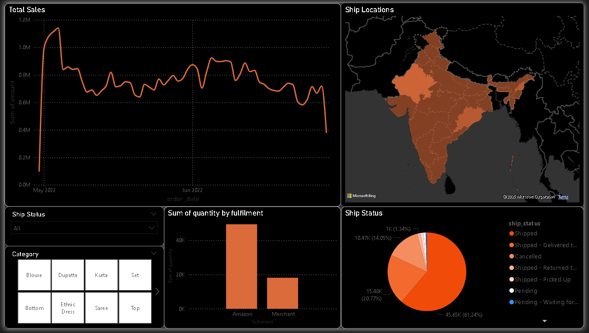

# Amazon-Sale-Report-Project (E-commerce)

Overview
This project analyzes e-commerce order data to uncover key business insights. We explore sales performance, shipping trends, and customer behavior, using Excel, SQL, Power BI, and Python.

## Important note: This dataset comprises one single table with no relationships. All the analysis is done subsequently. I'll have a project with more related tables in the future.

## 📊 Dataset
- **Source:** https://www.kaggle.com/datasets/thedevastator/unlock-profits-with-e-commerce-sales-data
- **Size:** 74,538 rows, 23 columns
- **Main Columns:**

  - `index` : Index number of the dataset. The dataset has mixed order as received from the raw file.
  - `Order ID` : Unique identifier for each order
  - `Date` : Date when the order is placed (Format: MM/DD/YYYY)
  - `Status` : Status of order since it was placed (Values: Shipped, Cancelled, Pending - Waiting for Pick Up, Shipped - Delivered to Buyer, Shipped - Returned to Seller, Pending, Shipped - Picked Up, Shipping, Shipped - Returning to Seller, Shipped - Out for Delivery, Shipped - Rejected by Buyer, Shipped - Damaged, Shipped - Lost in Transit)
  - `Fulfilment` : Who are responsible for the fulfilment (Values: Amazon, Merchant)
  - `Sales Channel` : (Values: Amazon.in, Non-Amazon)
  - `ship-service-level` : (Values: Expedited, Standard)
  - `Style` : The code for the style of the product
  - `SKU` : SKU of the product category
  - `Category` : Category of the product (Values: Kurta, Set, Top, Western Dress, Blouse, Bottom, Ethnic Dress, Saree, Dupatta)
  - `Size` : Size of the product (Values: XL, M, L, XXL, 3XL, S, XS, 6XL, 5XL, 4XL, Free)
  - `ASIN` : Amazon Standard Identification Number
  - `Courier Status` : (Values: Shipped, Unshipped, Cancelled, [blank])
  - `Qty` : How many products purchased in an order
  - `currency` : Currency used for payment (Value(s): INR)
  - `Amount` : The total money of the order
  - `ship_city` : Destinated city to ship to
  - `ship-state` : Destinated state to ship to 
  - `ship-postal-code` : Destinated postal to ship to
  - `ship-country` : (Values: IN)
  - `promotion-ids` : Applied promotion ids for the order. This column has very long texts of all the applied promotions for the order.
  - `B2B` : Whether if it's a B2B sales (Values: true, false)
  - `fulfilled-by` : (Values: Not Specified, Easy Ship)

## 📌 Process
### ✅ **Phase 1: Data Cleaning & Importation**
- Initial Data Cleaning (especially for the "ship_city" column), select correct date format, remove duplicates.
- Imported dataset into SQL by creating table and optimized using LOAD INTO
- Handled missing values & duplicates (SQL)
- Standardized column names (Power Query)
- Fixed incorrect date formats (Power Query)

### ✅ **Phase 2: Exploratory Data Analysis**
- Top-selling product categories  
- Sales trends over time  
- Most common shipping destinations  

**Power BI Dashboard:**

- Connected to database in MySQL
- Transform data: Select correct data format & type (Add geographical data categories to columns: ship_country,ship_postal_code)
- Add calculated columns "ship_location" (combining ship_state, ship_country) using DAX formula & assigned "Place" category for consistent mapping
- Added Map
- Added Line graph
- Added Slicer
- Added Pie Chart for ship_status

**Excel Analysis:**

### ✅ **Phase 3: Advanced Analysis (DAX & SQL)**

**SQL:**
- Wrote query to find Month over Month Total Sales using CTEs and Window Functions (LAG())
- Added query to find Top-5 Fastest Growing Product Category
- Added query to Identify Orders with Delayed Fulfillment
- Added query to Analyze the Impact of Shipping Service Levels On Delivery Success
- Added query to find the regions (states) with the highest rate of cancellation.

**Power BI:** (On-going)
- Created a Running Total of Amount over the 3-month period. ('Phase 3' sheet)

### ✅ **Phase 4: Predictive Insights & Automation** (On-going)

## 📈 Key Insights (On-going)
- 💰 **Top-Selling Category:** Clothing Set
- 🚚 **Shipping Service Level with Highest Shipping Success Rate:** Expedited (86.43% success rate)
- 🚚 **Standard Service has a Major Shipping Problem, at:** Only 2.5% Shipping Success Rate
- 🌍 **Top Markets (by Sales Amount/State):**  Maharashtra (INR 7,879,715.27)
- 🌍 **The regions (states) with the highest rate of cancellation relative to number of orders:** Himachal Pradesh (449 orders, 110 cancellations/returns)

## 💾 How to Use
1. Download `dashboards.pbix` to explore the Power BI visualizations  
2. Open `analysis.xlsx` to see Excel pivot tables  
---
